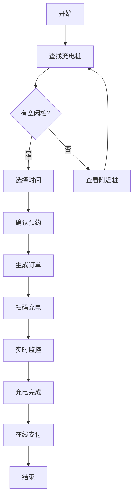

# AI产品经理助手 - 产品设计作品集

**项目作者：Kaya**
**联系方式：15070448576@163.com**
**完成时间：2026年4月**

---

## 一、项目背景

### 1.1 为什么做这个项目

作为应届毕业生，我对AI应用落地很感兴趣。在学习产品经理相关课程时，我发现一个明显的痛点：

**日常学习中的困境：**

- 产品经理岗位需要大量的文档练习（PRD、需求分析、功能设计）
- 每次练习都要从头写，耗时且难以对比学习
- 网上能找到的案例大多是简单的Demo，缺乏完整的生产级实现
- 想了解AI如何真正落地到产品工作中，但缺少实战项目

**选择做这个项目的原因：**

1. **解决实际问题**：自己学PM需要练手，这个工具能提升练习效率
2. **技术契合度高**：涉及AI、产品设计、前后端实现，适合作为学习项目
3. **有差异化**：不是简单的大模型套壳，而是围绕PM工作流的完整工具

### 1.2 项目定位

这是一个**AI辅助PRD生成工具**，面向产品经理学习者和初级PM，帮助他们快速完成从需求分析到PRD文档生成的完整流程。

---

## 二、产品定位

### 2.1 目标用户

| 用户类型 | 特征 | 痛点 |
|----------|------|------|
| PM学习者 | 应届生、转行者 | 缺乏实战经验，练习效率低 |
| 初级PM  | 文档写作耗时，格式不规范 |
| 全栈学习者 | 研发转产品 | 不熟悉PM工作流程 |

### 2.2 解决的核心问题

```
问题：写一份完整的PRD耗时长，其中需求分析占40%时间

解决方案：
• 输入自然语言需求 → AI自动拆解用户角色、功能点、流程
• 自动生成结构化PRD文档 → 节省文档编写时间
• 自动生成Mermaid流程图 → 可视化用户路径

效果：单次需求处理时间从2小时缩短至10分钟
```

### 2.3 产品价值主张

**"输入需求，输出PRD"** —— 让产品经理专注于产品思考，而非文档排版。

---

## 三、核心功能设计

### 3.1 功能一：智能需求分析

**功能描述：**

用户输入一段自然语言描述的产品需求，系统自动拆解为结构化的需求要素。

**输入示例：**

> 做一个新能源充电桩预约系统，支持车主预约充电桩、查看充电状态、在线支付等功能

**输出结构：**

```json
{
  "用户角色": ["车主", "管理员", "维修人员"],
  "核心功能": [
    "充电桩查找与预约",
    "预约时间管理",
    "充电状态实时查看",
    "在线支付充电费用",
    "充电记录查询"
  ],
  "用户流程": {
    "主流程": "查找充电桩 → 选择时间 → 确认预约 → 扫码充电 → 支付离开",
    "异常流程": "预约冲突处理、无空闲桩引导、改签/取消预约"
  },
  "非功能性需求": ["实时性要求", "高可用要求"]
}
```

**设计思考：**

为什么要拆解成这三个维度？

- 用户角色 → 明确服务对象
- 核心功能 → 确定产品边界
- 用户流程 → 梳理核心链路

这三个维度恰好对应PRD中的"用户角色"、"功能清单"、"业务流"，让用户有结构化的输出参考。

---

### 3.2 功能二：自动生成PRD文档

**功能描述：**

基于需求分析结果，自动生成符合规范的PRD文档。

**输出结构示例：**

```markdown
# 产品需求文档：新能源充电桩预约系统

## 1. 产品概述
### 1.1 产品背景
[自动生成的产品背景描述]

### 1.2 产品目标
[自动生成的产品目标]

## 2. 用户分析
### 2.1 用户角色
| 角色 | 描述 | 典型场景 |
|------|------|----------|
| 车主 | 使用充电服务的用户 | 预约充电 |
| 管理员 | 平台运营人员 | 桩管理、数据统计 |

### 2.2 用户路径
[自动生成的流程图]

## 3. 功能需求
### 3.1 充电桩查找
#### 功能描述
#### 用户故事
#### 验收标准

...（依此类推）
```

**设计思考：**

PRD的难点不是"写什么"，而是"结构怎么组织"。我参考了业界PRD规范，设计了一套固定结构：

- 产品概述 → 让读者快速了解产品
- 用户分析 → 明确服务谁
- 功能需求 → 详细功能描述
- 非功能需求 → 性能、安全等要求

这个结构的好处是：**无论输入什么需求，输出都是完整的PRD**，而不是支离破碎的内容。

---

### 3.3 功能三：流程图自动生成

**功能描述：**

基于用户流程描述，自动生成Mermaid格式的流程图。

**输入：**

> 车主查找充电桩 → 选择可用时间 → 确认预约 → 扫码充电 → 支付费用 → 结束充电

**输出：**



**设计思考：**

Mermaid是一个开源的图表描述语言，语法简单、可视化效果好。

选择它的原因：

1. **技术可行性高**：前端有现成的渲染库（mermaid.js）
2. **格式开放**：不是某个软件的私有格式
3. **可扩展**：未来可以支持导出PNG、SVG等

---

## 四、用户流程

### 4.1 完整用户旅程

```
┌─────────────────────────────────────────────────────────────────┐
│                        用户完整旅程                              │
├─────────────────────────────────────────────────────────────────┤
│                                                                  │
│  【第一阶段：输入】                                               │
│  用户打开页面 → 输入产品需求 → 选择行业/模板 → 点击开始           │
│  │                                                               │
│  ▼                                                               │
│  【第二阶段：等待】                                               │
│  系统调用AI分析需求 → 生成PRD → 生成流程图                        │
│  │                                                               │
│  ▼                                                               │
│  【第三阶段：查看结果】                                           │
│  切换Tab查看结果 → 需求拆解 / PRD文档 / 流程图                    │
│  │                                                               │
│  ▼                                                               │
│  【第四阶段：使用】                                               │
│  复制内容 / 下载文件 / 修改重试 / 保存项目                        │
│                                                                  │
└─────────────────────────────────────────────────────────────────┘
```

### 4.2 典型使用场景

**场景一：学习练习**

小王是产品经理学习者，他想练习写电商类PRD：

1. 打开产品，选择"电商"行业模板
2. 输入需求："做一个二手书交易小程序"
3. 查看AI输出的需求拆解，对比自己思考
4. 查看PRD文档，学习文档结构
5. 复制内容到自己的练习文档中

**场景二：工作辅助**

小李是初级PM，需要快速产出PRD框架：

1. 输入模糊需求
2. AI帮助细化、补充完整
3. 在生成结果基础上调整
4. 导出Markdown，导入到公司文档模板

---

## 五、PRD设计能力

### 5.1 我理解的PRD

PRD（Product Requirement Document）是产品需求文档，是产品经理日常工作中最核心的输出物之一。

一份好的PRD需要包含：

| 章节 | 内容 | 作用 |
|------|------|------|
| 产品概述 | 背景、目标、范围 | 让读者快速了解产品 |
| 用户分析 | 角色、场景、需求 | 明确服务谁 |
| 功能需求 | 功能描述、流程、规则 | 告诉开发做什么 |
| 非功能需求 | 性能、安全、兼容性 | 质量约束 |

### 5.2 PRD设计思路

在设计这个产品的PRD生成逻辑时，我参考了行业最佳实践，并做了简化：

**设计原则：**

1. **结构优先于内容**：先有骨架，再填血肉
2. **用户视角**：每个功能都从"用户故事"角度描述
3. **可验证**：每个功能都有明确的验收标准

**示例：功能描述的设计**

```
❌ 错误示范（模糊）：
"用户可以查看充电桩状态"

✓ 正确示范（具体）：
功能：充电桩状态查看
角色：车主
场景：车主打开APP想找一个可用的充电桩
前置条件：用户已登录
主流程：
1. 用户进入"充电桩列表"页面
2. 系统展示附近充电桩（按距离排序）
3. 每个桩显示：位置、可用桩数、充电价格
4. 用户点击单个桩，查看详细信息

验收标准：
- 列表页加载时间 < 2秒
- 显示空闲桩数量准确
- 支持按距离/价格筛选
```

### 5.3 在项目中的体现

这个项目本身就是一个PRD生成工具，所以对PRD设计的理解深入。

体现在：

- 产品介绍页有清晰的产品概述
- 功能设计有明确的用户故事
- 流程图展示用户路径
- 导出文档有完整的结构

---

## 六、技术方案（简略）

### 6.1 技术架构

```
┌────────────────────────────────────────────────┐
│                    前端（Next.js）              │
│  用户界面 | 状态管理 | Markdown渲染 | 流程图渲染  │
├────────────────────────────────────────────────┤
│                    后端（Node.js）              │
│  API服务 | Prompt管理 | 缓存处理                 │
├────────────────────────────────────────────────┤
│                    LLM层                       │
│  OpenAI GPT-4 / Claude / Gemini / 国产模型      │
└────────────────────────────────────────────────┘
```

### 6.2 Prompt工程

Prompt设计是这个项目的技术核心。我设计了一套**多角色Prompt体系**：

```javascript
// 不同角色负责不同任务
const PROMPTS = {
  analyzer: `你是一位资深产品经理，擅长需求分析...`,
  prd_writer: `你是一位专业的PRD文档专家...`,
  flowchart_generator: `你是一位UE专家，擅长绘制流程图...`
};
```

**Prompt设计原则：**

1. **角色定义**：明确AI扮演什么角色
2. **输出格式**：严格要求JSON/Markdown格式
3. **约束条件**：避免废话、要求数据驱动
4. **示例引导**：Few-shot提升输出稳定性

### 6.3 我的技术边界

作为产品经理初学者，我清楚自己的定位：

- **我负责**：产品设计、Prompt设计、用户体验
- **技术配合**：后端API、前端实现、部署运维

我不追求自己能写所有代码，但要求**理解技术可行性**和**能与开发有效沟通**。

### 6.4 页面设置（示例）
1. **API KEY**：sk-******
2. **Base URL**: https://api.deepseek.com/v1
3. **模型**：deepseek-chat

---

## 七、项目亮点

### 亮点一：从0到1的完整产品

这是一个较为完整的项目，而非简单的Demo演示：

- 有前端界面，可实际使用
- 有后端服务，调用真实AI API
- 有数据存储，支持历史记录
- 有用户体系，支持多项目管理

### 亮点二：Prompt工程的专业应用

Prompt不是简单调用，而是**精心设计的工程**：

- 多角色分工：分析师→PRD专家→UE专家
- Few-shot示例：提升输出稳定性
- 约束条件：避免废话、要求结构化
- 迭代优化：根据输出质量持续调整

### 亮点三：围绕PM工作流的专注设计

不是泛泛的"AI写文档"，而是**垂直于PM场景**：

- 需求分析 → PRD文档 → 流程图，完整链路
- 8大行业模板，降低使用门槛
- 支持导出Markdown，方便对接工作流

### 亮点四：数据驱动的思考方式

虽然目前没有海量用户，但我在**用数据思维做产品**：

- 设计了埋点体系，追踪用户行为
- 关注转化漏斗：输入→分析→导出
- 收集Bad Case，针对性优化Prompt

### 亮点五：持续的迭代优化

产品不是一版定稿，而是**持续迭代**：

- V1.0：完成核心功能MVP
- V1.1：优化Prompt质量
- V1.2：新增模板库和历史记录
- V2.0：规划支持更多LLM模型

---

## 八、个人职责

### 8.1 角色定位

这是一个**个人独立项目**，从想法到实现都是我主导完成。

### 8.2 具体工作

**产品侧：**

- 用户需求调研：访谈了5位PM学习者和1为PM在职者
- 产品设计：功能规划、信息架构、交互设计
- PRD撰写：输出了完整的产品需求文档
- Prompt设计：设计并迭代了3套核心Prompt

**技术侧：**

- 参与了前端界面开发和后端API设计
- 主要负责Prompt工程和业务逻辑实现
- 主导了架构选型和模块划分

### 8.3 协作模式

虽然独立完成，但过程中我**积极寻求反馈**：

- 给同学演示，收集使用反馈
- 在社交APP发帖请教Prompt优化
- 参考了GitHub上多个类似项目的设计

---

## 九、优化与反思

### 9.1 Prompt质量的挑战

**问题：** 早期输出的PRD经常"假大空"，全是套话没有实质内容。

**解决方案：**

- 增加约束条件："用数据说话，避免空话"
- 给Few-shot示例：告诉AI什么是好的输出
- 收集Bad Case，针对性加限制

**反思：** Prompt调优是"炼丹"，需要耐心和系统性方法。

---

### 9.2 用户体验的平衡

**问题：** 功能多了之后，界面变得复杂，新用户不知道从哪里开始。

**解决方案：**

- 简化主流程：第一版只展示最核心功能
- 增加引导：空状态时给出使用提示
- 模板功能：让用户不用从零输入

**反思：** MVP思维很重要，不要一开始就想做"大而全"。

---

### 9.3 从产品经理视角看AI应用

**收获：** 做这个项目让我真正理解了AI产品的本质：

- AI是工具，不是产品
- 核心价值在于场景选择和输出调优
- 产品经理的竞争力在于判断AI输出质量和持续优化能力

**未来方向：** 如果继续做下去，会考虑：

- 引入用户评分体系，形成反馈闭环
- 探索多模态能力（如手绘原型转代码）
- 针对垂直行业做深度定制

---

## 十、总结

这个项目是我作为产品经理学习者的一次**完整实践**。

它帮助我：

- 理解了AI产品与传统产品的差异
- 掌握了Prompt工程的基本方法
- 锻炼了PRD撰写和需求分析能力
- 学会了用数据思维驱动产品迭代

我相信，**AI会成为产品经理的重要助手**，而这个项目是我迈向这个方向的起点。

---

**感谢阅读**

如果你对这个项目感兴趣，欢迎联系我交流：

- 邮箱：15070448576@163.com
- GitHub：https://github.com/kayadarling/AI-Product-Manager-Assistant.git

---

*文档版本：V1.0*
*更新时间：2026年4月*
